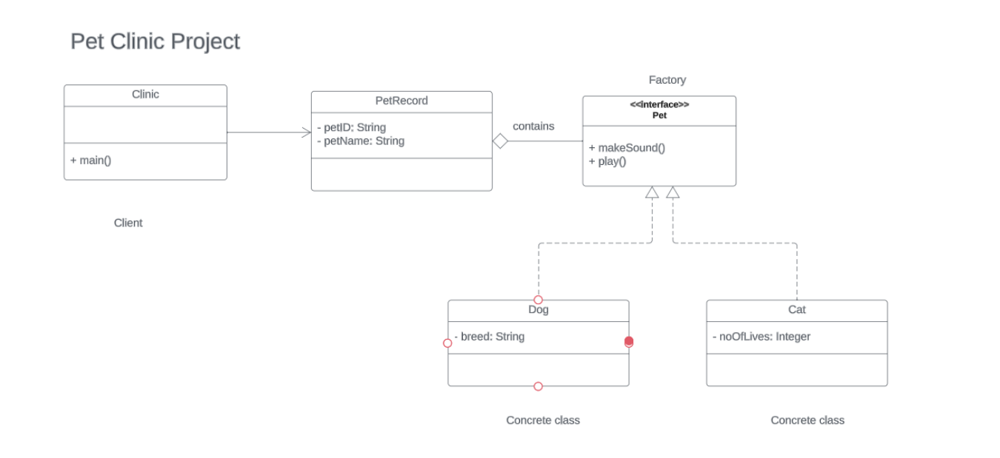

## Problem Scenario
Implement factory design pattern using Pet as the factory interface. The interface implements two methods: makeSound() and play().

Dog and Cat are concrete objects that implements Pet interface.

PetRecord holds attributes such as petId, petName, and Pet.

Clinic would be the client object.

Refer to the UML Class Diagram

## UML Class Diagram

